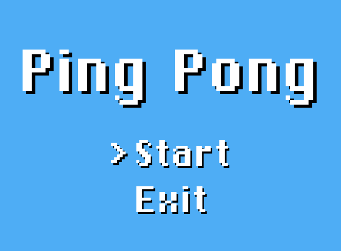

# Godot
Here all projects created with Godot Game Engine are collected and placed.

## JumpMan
Basically, it's the first project I've created with Godot. It doesn't really have any purpose but looks good.
Didn't want to make a dull platformer, thus 3D game was made instead.

**Discoveries:**
* Basics of GDScript
* Basics of Scene structure
* Basic movements
* Different types of cameras (First-Person, Fixed, Smooth)

**Previews:**

## Pong
A project which includes GUI, sound effects and pretty-looking font.

**Discoveries:**
* GUI structure
* Audio processing and sound effects
* Including custom font

**Previews:**

