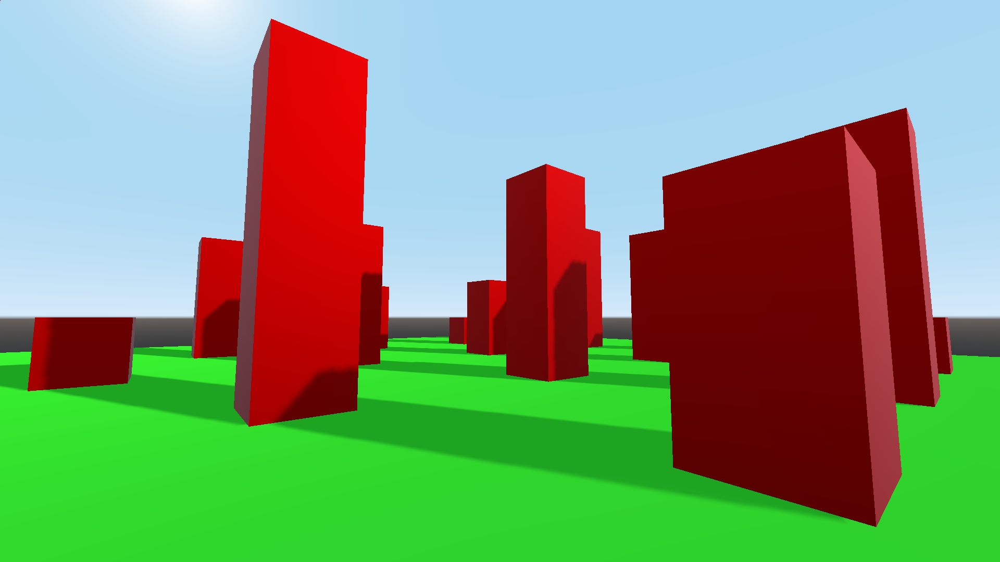
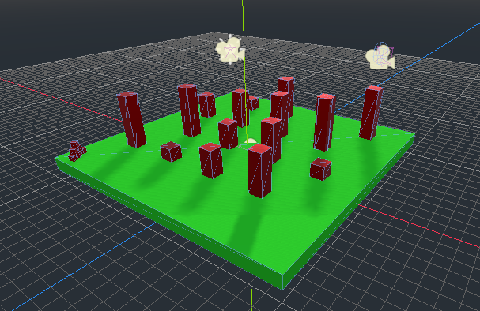

# Godot
Here all projects created with Godot Game Engine are collected and placed.

## JumpMan
Basically, it's the first project I've created with Godot. It doesn't really have any purpose but looks good.
Didn't want to make a dull platformer, thus 3D game was made instead.

Some things I've learnt or discovered:
* Basics of GDScript
* Basics of Scene structure of a project
* Basic movements
* Different types of cameras (First-Person, Fixed, Smooth)

Some previews of the game:

