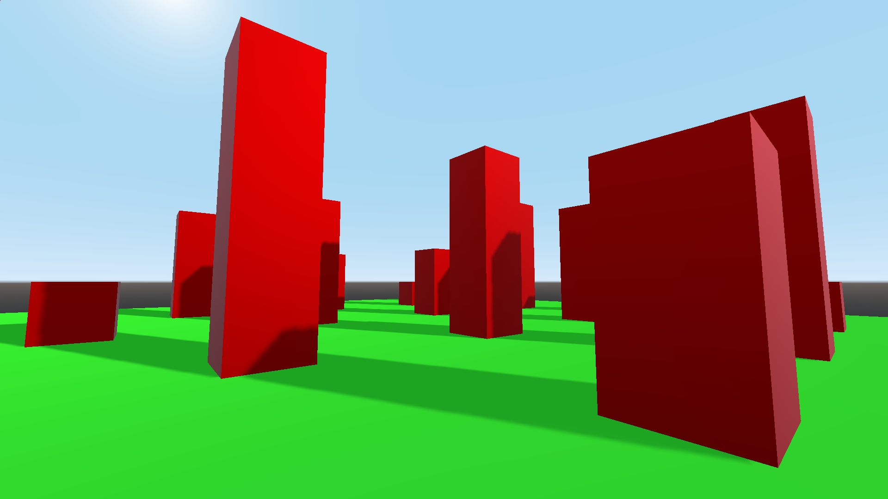
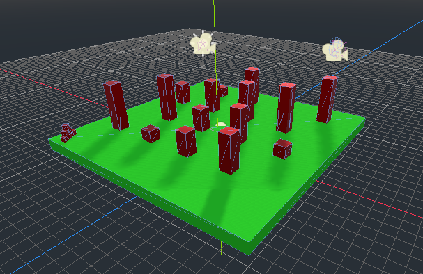
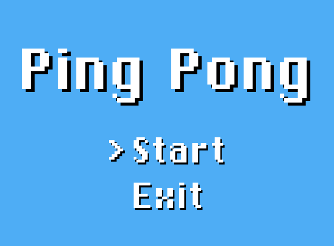
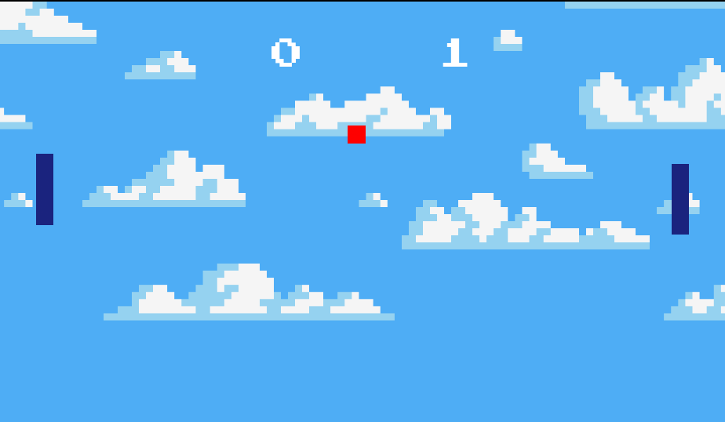
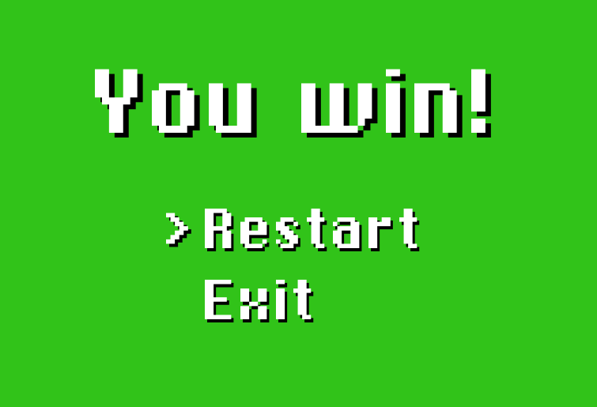
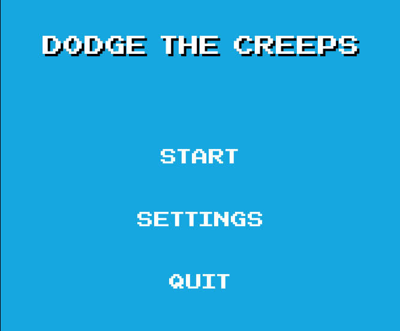
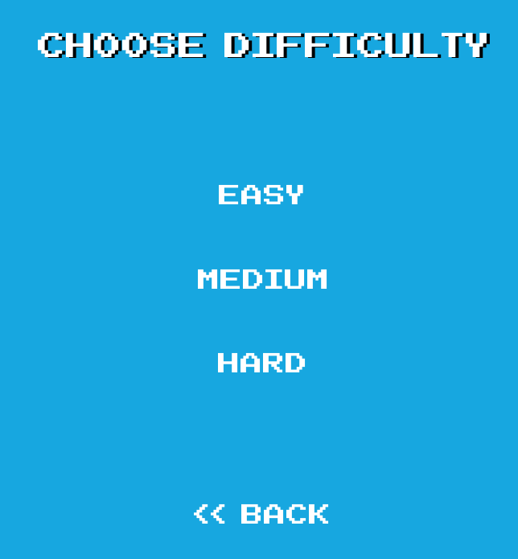
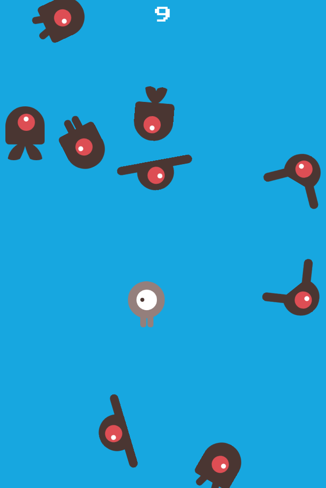

# Godot
Here all projects created with Godot Game Engine are collected and placed.

## JumpMan
Basically, it's the first project I've created with Godot. It doesn't really have any purpose but looks good.
Didn't want to make a dull platformer, thus 3D game was made instead.

**Discoveries:**
* Basics of GDScript
* Basics of Scene structure
* Basic movements
* Different types of cameras (First-Person, Fixed, Smooth)

**Previews:**

## Pong
A project which includes GUI, sound effects and pretty-looking font. Big thanks to [Clear Code](https://youtu.be/kr1BoEbuveI) for the idea.

**Discoveries:**
* GUI structure
* Audio processing and sound effects
* Including custom font

**Previews:**

## Tutorial Game
A project with which the whole Godot learning journey should be started. Big thanks to [Godot Docs](https://docs.godotengine.org/en/stable/getting_started/step_by_step/your_first_game.html) and [GDQuest](https://youtu.be/WEt2JHEe-do) for the main idea and also to [TheBuffED](https://youtu.be/WEt2JHEe-do) for difficulty menu settings.

**Discoveries:**
* Difficulty menu
* Tweens and Paths
* Signals

**Previews:**

